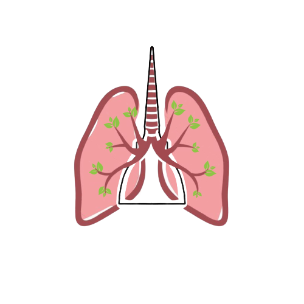

[contributors-shield]: https://img.shields.io/github/contributors/alfcar62/respir-avo.svg?style=flat-square
[contributors-url]: https://github.com/alfcar62/respir-avo/graphs/contributors
[forks-shield]: https://img.shields.io/github/forks/alfcar62/respir-avo.svg?style=flat-square
[forks-url]: https://github.com/alfcar62/respir-avo/network/members
[stars-shield]: https://img.shields.io/github/stars/alfcar62/respir-avo.svg?style=flat-square
[stars-url]: https://github.com/alfcar62/respir-avo/stargazers
[issues-shield]: https://img.shields.io/github/issues/alfcar62/respir-avo.svg?style=flat-square
[issues-url]: https://github.com/alfcar62/respir-avo/issues
[license-shield]: https://img.shields.io/github/license/alfcar62/respir-avo.svg?style=flat-square
[license-url]: https://github.com/alfcar62/respir-avo/blob/master/LICENSE

[![Contributors][contributors-shield]][contributors-url]
[![Forks][forks-shield]][forks-url]
[![Stargazers][stars-shield]][stars-url]
[![Issues][issues-shield]][issues-url]
[![MIT License][license-shield]][license-url]
 

  <h1 align="center"> RespirAVO </h1>
  
 RespirAVO è un progetto del <a href=""https://www.itisavogadro.org/">IIS Amedeo Avogadro di Torino</a>, realizzato dalla classe 3C Informatica (A.S. 2021/22) dell'IIS A. Avogadro di Torino, in collaborazione con altre classi e associazione "Torino Respira". Lo scopo è analizzare la qualità dell'aria che respiriamo a scuola e in generale nel percorso casa-scuola.

  

